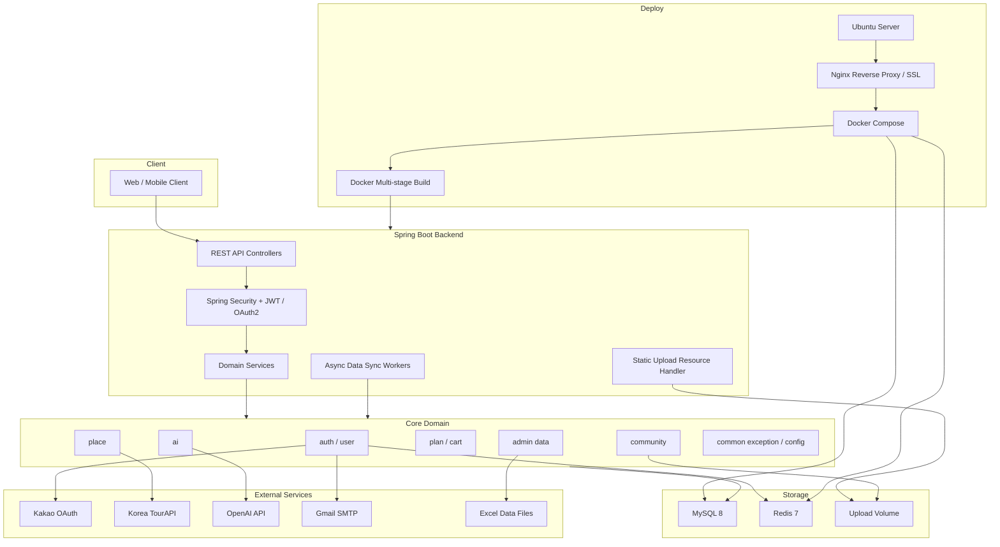
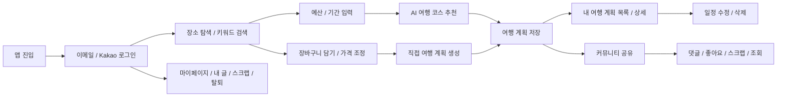
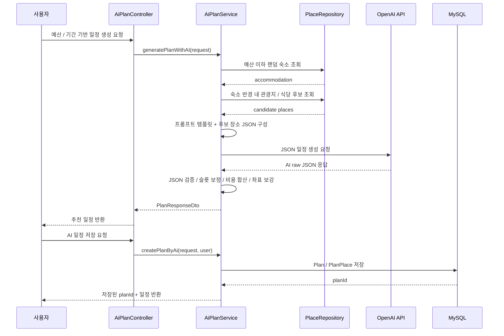
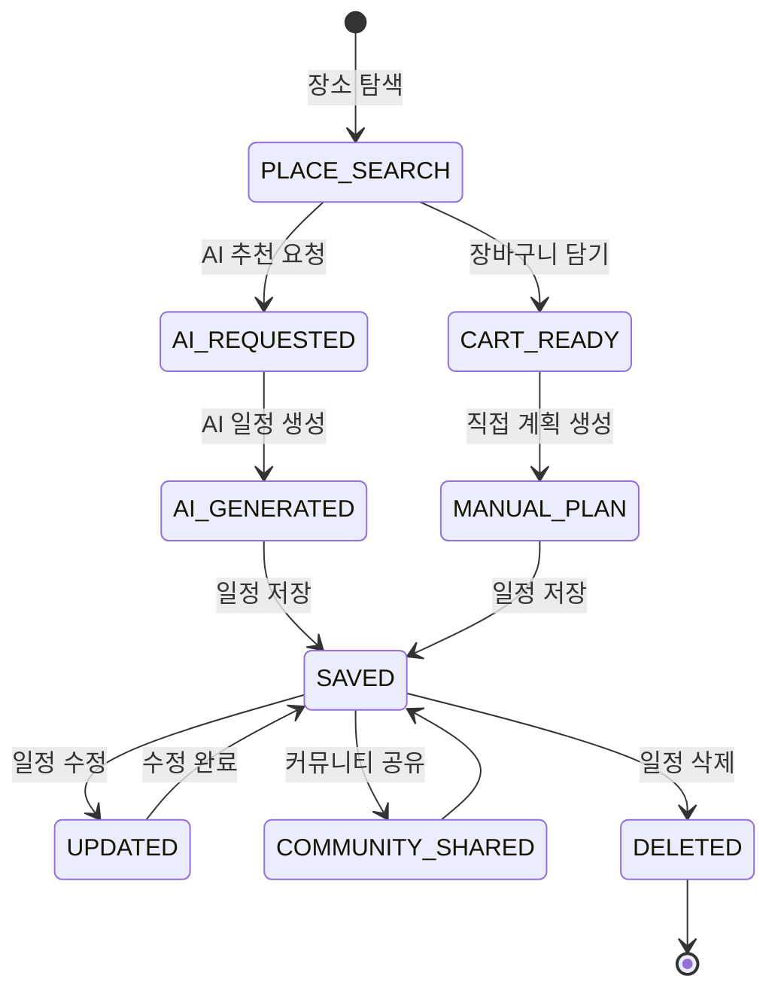
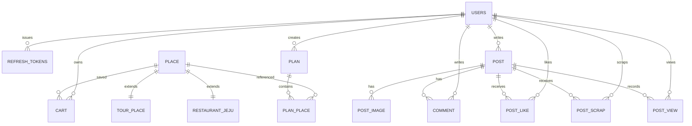
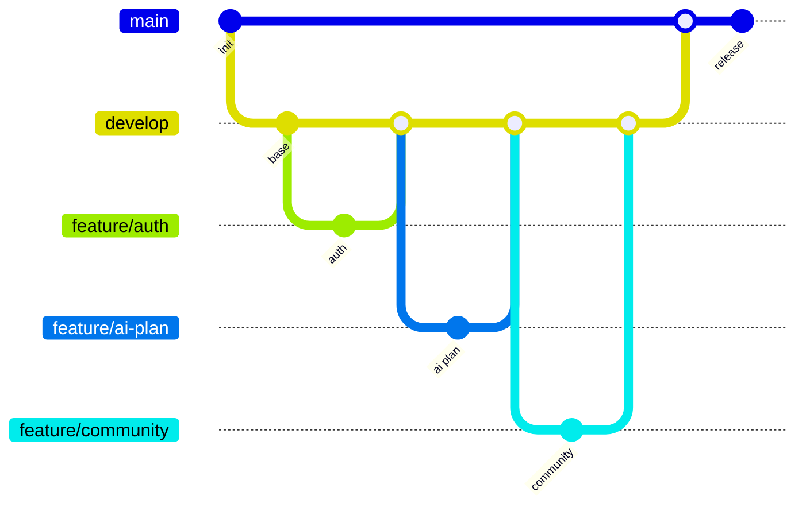

# 🧭 MoneyWay

`MoneyWay`는 **예산, 여행 기간, 장소 데이터를 기반으로 AI가 제주 여행 일정을 추천하고, 사용자가 직접 장소를 담아 여행 계획을 구성하며, 커뮤니티에서 여행 기록과 비용 정보를 공유할 수 있는 여행 예산 플랫폼**입니다.

단순 장소 조회에 그치지 않고 **공공 관광 데이터 수집, 맛집/카페 엑셀 업로드, 예산 기반 AI 코스 생성, 장바구니, 여행 계획 저장/수정, 이미지 기반 커뮤니티, 좋아요/스크랩/조회수, 이메일/Kakao 인증, 관리자 데이터 동기화, Docker/Nginx 배포**까지 하나의 서비스 흐름으로 설계했습니다.

<br>

# 📗 프로젝트 아키텍처



<br>

# 🎯 프로젝트 목표

**1. `예산 중심` AI 여행 일정 생성**
- 사용자가 입력한 예산과 여행 기간을 기준으로 숙소, 관광지/액티비티, 식당 예산을 분리합니다.
- DB에 저장된 실제 제주 장소 후보만 OpenAI 프롬프트에 전달하여 존재하지 않는 장소가 추천되지 않도록 제한했습니다.
- AI 응답을 JSON으로 검증한 뒤, 누락된 시간대, 카테고리 불일치, 좌표 누락, 비용 합산을 서버에서 후처리합니다.

**2. `장소 데이터 파이프라인` 구축**
- 한국관광공사 TourAPI에서 제주 관광지, 숙소, 액티비티, 쇼핑 데이터를 수집합니다.
- 맛집/카페 데이터와 관광지 가격/평점/대표 리뷰는 엑셀 업로드로 보강합니다.
- `Place`를 공통 부모로 두고 `TourPlace`, `RestaurantJeju`를 JOINED 상속 구조로 분리했습니다.

**3. `여행 계획 편집 흐름` 구현**
- 사용자는 장소를 장바구니에 담고, 가격을 조정한 뒤 여행 계획에 반영할 수 있습니다.
- AI가 생성한 일정을 바로 저장하거나, 빈 여행 계획을 생성해 직접 수정할 수 있습니다.
- 계획 조회, 목록, 수정, 삭제에서 사용자 소유권을 검증합니다.

**4. `여행 커뮤니티` 기능 제공**
- 여행 후기/공유 게시글을 이미지와 함께 작성하고, 좋아요와 스크랩을 토글할 수 있습니다.
- 댓글은 삭제 상태를 보존하는 방식으로 관리하고, 조회수는 사용자 또는 IP 기준으로 1시간 중복 증가를 방지합니다.
- 게시글 목록은 최신순, 좋아요순, 댓글순, 스크랩순으로 정렬할 수 있습니다.

**5. `운영과 배포`까지 고려한 백엔드 구성**
- Swagger 그룹 문서, 공통 예외 응답, JWT 인증 필터, CORS, 정적 업로드 경로를 분리했습니다.
- Docker multi-stage build, Docker Compose, Nginx SSL reverse proxy, 업로드 볼륨 구성을 포함했습니다.
- Redis를 활용해 비밀번호 재설정 이메일 인증코드와 인증 완료 상태를 TTL 기반으로 관리합니다.

<br>

# 🧩 사용 기술

- Java 21
- Spring Boot 3.4.5
- Spring Web MVC
- Spring Data JPA / Hibernate
- Spring Security
- OAuth2 Client
- JWT
- MySQL 8
- Redis 7
- OpenAI API
- Korea TourAPI
- Spring Mail
- Apache POI
- Swagger / Springdoc OpenAPI
- OkHttp
- Lombok
- Gradle
- Docker
- Docker Compose
- Nginx
- JUnit5 / AssertJ

<br>

# ✏️️ 프로토타입

현재 저장소는 백엔드 중심 프로젝트이므로, 화면 이미지 대신 클라이언트와 연동되는 핵심 사용자 흐름을 기준으로 정리했습니다.



<br>

# 📌 주요 기능

**1. 회원 / 인증**
- 이메일 회원가입, 로그인, 로그아웃 지원
- Kakao OAuth2 로그인 및 기존 이메일 계정과 Kakao 계정 연결
- JWT access token 발급, refresh token 저장, HttpOnly cookie 기반 access token 재발급
- Redis TTL 기반 비밀번호 재설정 인증코드 발송/검증
- 마이페이지, 닉네임 변경, 비밀번호 변경, 회원 탈퇴, 내 게시글/스크랩 조회

**2. 장소 조회 / 데이터 관리**
- 장소 카테고리별 조회: `RESTAURANT`, `CAFE`, `ACCOMMODATION`, `TOURIST_ATTRACTION`, `ACTIVITY`, `SHOPPING`
- 장소 키워드 검색과 페이징/비페이징 조회 API 제공
- 관광지 상세 조회는 TourAPI `contentId` 기준으로 처리
- 관리자 API로 TourAPI 전체 데이터 및 상세 정보 동기화
- 엑셀 업로드를 통한 맛집/카페 데이터 등록, 관광지 가격/평점/대표 리뷰 업데이트

**3. AI 여행 플래너**
- 예산과 여행 기간을 입력하면 숙소 1개를 기준으로 반경 5km 이내 관광지/식당 후보를 조회
- 숙소, 관광, 식비 예산을 분리하여 후보 장소를 필터링
- OpenAI `gpt-4o-mini` 호출 후 JSON 응답 검증
- 오전, 점심, 카페, 오후, 저녁, 숙소 슬롯을 강제하고 누락 슬롯을 보정
- 총 사용 비용, 일차별 비용, 장소 좌표, 카테고리, 방문 시간을 포함한 일정 반환
- AI 생성 결과를 `Plan`과 `PlanPlace`로 저장

**4. 장바구니 / 여행 계획**
- 장소 장바구니 추가, 조회, 가격 수정, 삭제
- 중복 장소 추가 시 멱등 처리
- 빈 여행 계획 생성, 내 계획 목록 조회, 상세 조회, 수정, 삭제
- 계획 수정 시 기존 장소 구성을 교체하고 사용된 장바구니 항목을 정리
- 여행 계획 접근 시 작성자 권한 검증

**5. 커뮤니티**
- multipart 기반 게시글 작성/수정: 썸네일 1개, 본문 이미지 최대 10개
- 이미지 MIME type, 파일 크기, 이미지 개수 검증
- 게시글 상세 조회, 목록 조회, 사용자별 게시글 조회
- 댓글 작성/삭제 및 게시글 상세 응답 내 댓글 포함
- 좋아요/스크랩 토글과 사용자별 상태 반환
- 사용자 또는 IP 기준 1시간 조회수 중복 증가 방지

**6. 운영 / 배포**
- Swagger 그룹 문서: `admin`, `ai`, `auth`, `community`, `place`, `plan`, `user`
- 공통 `ErrorCode`, `GlobalExceptionHandler`, 인증 실패/인가 실패 핸들러 분리
- 업로드 파일을 서버 볼륨에 저장하고 `/uploads/**` 정적 경로로 제공
- Docker multi-stage build로 `app.jar` 생성 후 경량 JRE 이미지에서 실행
- Docker Compose로 애플리케이션, MySQL, Redis를 함께 구성
- Nginx reverse proxy, HTTPS, 업로드 캐싱, 대용량 multipart 요청 설정

<br>

# 📚 설계

AI 여행 일정 생성, 여행 계획 상태 흐름, ER 다이어그램 순서로 설계했습니다.

- 서비스를 단순 CRUD가 아니라 `장소 데이터`, `AI 추천`, `일정 편집`, `커뮤니티`, `인증`의 흐름으로 분리했습니다.
- 외부 API 호출과 데이터 보정은 서비스 계층에서 처리하고, 컨트롤러는 요청/응답 계약에 집중하도록 구성했습니다.
- 공통 인증, 예외, Swagger, CORS, 업로드 리소스 설정은 `common` 영역으로 분리했습니다.

## 1. AI 여행 일정 생성 커뮤니케이션 다이어그램



## 2. 여행 계획 흐름 다이어그램



## 3. ER 다이어그램



<br>

# 🚀 실행 가이드

## 1. 요구 사항

- Java 21
- Gradle 8.x
- MySQL 8
- Redis 7
- OpenAI API key
- TourAPI service key
- Kakao OAuth client id
- SMTP mail account

## 2. 로컬 실행

```bash
git clone https://github.com/{your-github-username}/MoneyWay1.git
cd MoneyWay1

./gradlew clean bootJar
java -jar build/libs/app.jar --spring.profiles.active=local
```

## 3. Docker Compose 실행

```bash
docker compose up -d --build
```

## 4. 주요 환경 변수

```env
MYSQLHOST=localhost
MYSQLPORT=3306
MYSQLDATABASE=moneyway
MYSQLUSER=root
MYSQLPASSWORD=your_mysql_password

REDISHOST=localhost
REDISPORT=6379
REDISPASSWORD=your_redis_password

JWT_ISSUER=MoneyWay-Auth-Server
JWT_SECRET_KEY=your_jwt_secret

MAIL_USERNAME=your_mail_username
MAIL_PASSWORD=your_mail_password

KAKAO_CLIENT_ID=your_kakao_client_id
OAUTH_BACKEND_CALLBACK_URI=http://localhost:8080/login/oauth2/code/kakao
OAUTH_FRONTEND_REDIRECT_URI=http://localhost:3000

TOUR_API_KEY=your_tour_api_key
OPENAI_API_KEY=your_openai_api_key
COOKIE_SECURE=false
```

## 5. API 문서

- Local Swagger UI: `http://localhost:8081/swagger-ui/index.html`
- Production Swagger UI: `https://moneyway.cloud/swagger-ui/index.html`

<br>

# 🥁 Git 브랜치 전략

프로젝트의 버전 관리 및 협업을 위해 Git-Flow 기반 전략을 사용합니다.



- **main**: 제품으로 출시될 수 있는 안정 버전 브랜치입니다.
- **develop**: 다음 배포 버전을 통합하는 브랜치입니다.
- **feature**: 기능 단위 개발 브랜치입니다. 구현과 검증이 끝나면 `develop` 브랜치에 병합합니다.
- **release**: 배포 전 최종 검증, 문서 정리, 버그 수정을 위한 브랜치입니다.
- **hotfix**: 운영 중 발생한 긴급 버그 수정을 위한 브랜치입니다.

<br>

> ### MoneyWay의 기록
> #### [Dockerfile](Dockerfile) | [Docker Compose](docker-compose.yml) | [Nginx 설정](nginx/moneyway.conf) | [AI 프롬프트](src/main/resources/prompt_template.txt) | [Swagger 설정](src/main/java/com/example/moneyway/common/config/SwaggerConfig.java)

